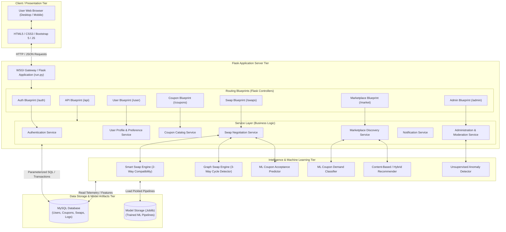
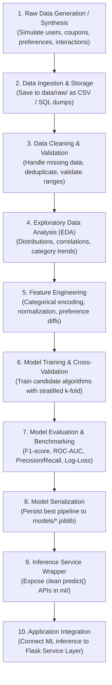
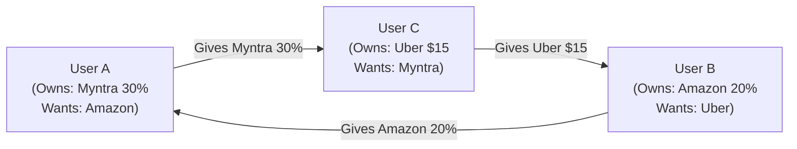
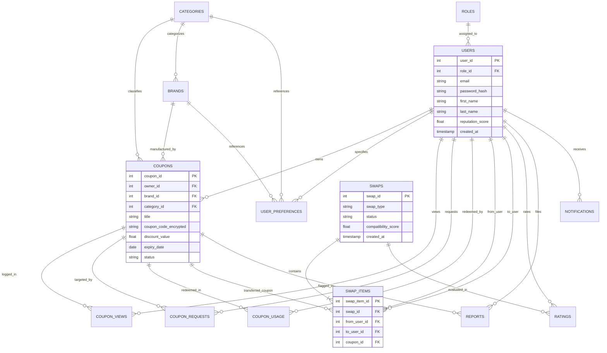

# System Architecture & Technical Specification

## Smart Coupon Swap System
**Document Version**: 1.0  
**Project Phase**: Phase 1 — Project Planning, Requirements & Architecture  
**Document Status**: Approved for Baseline  

---

## 1. System Architecture Overview

The **Smart Coupon Swap System** follows a modular, multi-tier, service-oriented monolithic architecture designed to balance maintainability, testability, high throughput, and seamless integration between transactional web workflows and machine learning inference pipelines.

### Architectural Tiers:
1. **Presentation Layer (Frontend)**: Responsive HTML5, CSS3, modern JavaScript, and Bootstrap 5 templates rendered via Jinja2 with asynchronous AJAX/Fetch interactions for dynamic elements.
2. **Application / Routing Layer (Flask)**: Modular Flask blueprints handling HTTP request routing, input validation, authentication enforcement, and response formatting.
3. **Service Layer (Business Logic)**: Decoupled Python service modules encapsulating domain operations (Users, Coupons, Swaps, Notifications, Governance).
4. **Intelligence Layer (Data Science & ML Services)**: Independent analytics engines wrapping trained Scikit-learn models, cosine similarity matrix evaluators, graph cycle traversal algorithms, and explainable scoring heuristics.
5. **Persistence Layer (Database)**: Relational MySQL database enforcing ACID transactional boundaries, foreign-key constraints, and schema indexing.

---

## 2. High-Level Architecture Diagram



---

## 3. Detailed Component Descriptions

### 3.1 Presentation Layer
* **Bootstrap 5 UI**: Fully responsive grid layout supporting mobile, tablet, and desktop viewports.
* **Jinja2 Server-Side Templating**: Reusable layout components (`base.html`, `navbar.html`, `alerts.html`, `footer.html`).
* **JavaScript Client Layer**: Dynamic AJAX calls for instant search filtering, real-time swap status polling, explainability tooltips, and interactive modal dialogs without full page reloads.

### 3.2 Flask Application Layer (Controllers)
* **Modular Blueprints**: Decoupled route handlers organized cleanly in `app/routes/`.
* **Request Validation & Security Middleware**: CSRF protection, input sanitization, authentication guards (`@login_required`, `@admin_required`).
* **Session Management**: Secure, cryptographically signed HTTP sessions storing user authentication states.

### 3.3 Service Layer (Business Logic)
* **CouponService**: Manages coupon ingestion, status mutations (`AVAILABLE`, `PENDING_SWAP`, `SWAPPED`, `EXPIRED`, `FLAGGED`), code masking, and expiration monitoring.
* **SwapService**: Orchestrates swap proposals, locks coupons in pending states, triggers compatibility evaluations, and commits atomic mutual transfers.
* **MarketplaceService**: Powers multi-attribute filtering, fuzzy keyword matching, and sorting criteria.
* **NotificationService**: Handles event-driven alerts for swap activities, approvals, and expiration warnings.
* **AdminService**: Exposes administrative governance queues, user management, and platform telemetry.

### 3.4 Intelligence Layer (Data Science & ML Services)
* Encapsulates all mathematical, statistical, and algorithmic computations.
* Exposes clean Python interfaces to the Service Layer so that application controllers never interact directly with raw ML estimators or graph libraries.
* Loads serialized models from the `models/` directory using Joblib.

---

## 4. End-to-End Data Science Pipeline

The Data Science lifecycle moves through ten disciplined stages from raw generation to production inference:



### Pipeline Details:
1. **Data Generation / Collection**: Generate realistic, statistically consistent synthetic datasets reflecting real-world e-commerce coupon behavior (brands, categories, discount types, usage logs, swap transactions).
2. **Data Cleaning**: Remove formatting discrepancies, handle missing values, validate date sequences (ensure expiry date > creation date), and eliminate invalid coupon codes.
3. **Exploratory Data Analysis (EDA)**: Conduct univariate, bivariate, and multivariate analysis in Jupyter notebooks (`notebooks/`) using Matplotlib, Seaborn, and Plotly to analyze discount distributions, user activity velocity, and category popularity.
4. **Feature Engineering**:
   * One-hot / frequency encoding of categories and brands.
   * MinMax / Standard scaling for continuous variables (discount amount, minimum purchase).
   * Temporal feature extraction: `days_to_expiry`, `listing_age_hours`.
   * Cross-attribute interaction features: `discount_to_min_purchase_ratio`, `user_category_affinity_score`.
5. **Model Evaluation & Benchmarking**: Rigorously evaluate multiple candidate algorithms using Stratified K-Fold cross-validation without generating fake metrics or ungrounded claims.
6. **Model Serialization**: Export Scikit-learn Pipelines (including preprocessors and estimators) via `joblib.dump()` into `models/`.

---

## 5. Planned Machine Learning Components

```mermaid
flowchart LR
    subgraph ML_Suite ["Integrated Machine Learning Suite"]
        direction TB
        subgraph CompA ["A. Acceptance Predictor"]
            M1["Supervised Binary Classifier"]
            F1["Features: User history, brand match,\ndiscount value, expiry days"]
            O1["Output: Probability P(Accept = 1)"]
            M1 --- F1 --- O1
        end

        subgraph CompB ["B. Recommendation Engine"]
            M2["Content-Based Cosine Similarity\n+ Collaborative Filtering"]
            F2["Features: User taste vector,\nCoupon attribute vector"]
            O2["Output: Top-K Ranked Coupons"]
            M2 --- F2 --- O2
        end

        subgraph CompC ["C. Demand Predictor"]
            M3["Multi-Class Classifier"]
            F3["Features: Views, clicks, requests,\nbrand tier, discount depth"]
            O3["Output: High / Medium / Low Tier"]
            M3 --- F3 --- O3
        end

        subgraph CompD ["D. Anomaly Detector"]
            M4["Unsupervised Isolation Forest / LOF"]
            F4["Features: Listing velocity, duplicate codes,\nrequest-cancel frequency"]
            O4["Output: Suspicious Flag (Admin Queue)"]
            M4 --- F4 --- O4
        end
    end
```



### 5.1 Component A: Coupon Acceptance Prediction
* **Problem Formulation**: Supervised binary classification. Given a potential swap proposal consisting of Target User $U$, Proposer's Coupon $C_{prop}$, and Target Coupon $C_{target}$, predict whether User $U$ will accept the proposal ($Y \in \{0, 1\}$).
* **Candidate Algorithms**:
  * Logistic Regression (Linear baseline with L2 regularization)
  * Decision Trees (Non-linear baseline with depth pruning)
  * Random Forest Classifier (Ensemble bagging to reduce variance)
  * Gradient Boosting Classifier (Sequential error minimization)
* **Feature Vector $\mathbf{x}_{\text{accept}}$**:
  * User demographic & behavioral telemetry: user age bracket, account tenure, historical swap acceptance rate.
  * Coupon attributes: category match flag, brand match flag, absolute discount difference ($|C_{prop} - C_{target}|$), relative discount ratio, remaining days until expiry.
  * Interaction telemetry: counterparty reputation score, previous direct interactions.
* **Evaluation Protocol**: Offline evaluation using 80/20 train-test split, 5-fold cross-validation, measuring Precision, Recall, F1-Score, and ROC-AUC.

### 5.2 Component B: Coupon Recommendation Engine
* **Problem Formulation**: Information retrieval and ranking. Given an authenticated user $U$, return the top-$K$ most relevant coupons from the active marketplace pool.
* **Techniques**:
  1. **Content-Based Filtering**:
     * Construct a coupon feature vector $\mathbf{v}_C$ by vectorizing category, brand, discount type, and discount magnitude.
     * Construct a user preference vector $\mathbf{p}_U$ based on user explicitly stated preferences and implicit interaction history (clicks, bookmarks, previous swaps).
     * Calculate cosine similarity:
       $$\text{Cosine Similarity}(\mathbf{p}_U, \mathbf{v}_C) = \frac{\mathbf{p}_U \cdot \mathbf{v}_C}{\|\mathbf{p}_U\|_2 \|\mathbf{v}_C\|_2}$$
     * Rank coupons in descending order of similarity score.
  2. **Collaborative Filtering Exploration**:
     * Construct user-coupon interaction matrix (implicit ratings derived from view time, requests, swaps).
     * Apply matrix factorization (Truncated SVD / NMF) when matrix density permits.
  3. **Hybrid Ensemble**:
     * Linearly combine normalized content-based scores and collaborative filtering predictions.

### 5.3 Component C: Coupon Demand Prediction
* **Problem Formulation**: Multi-class classification (or continuous regression mapped to ordinal categories). Predict whether a coupon will experience `High`, `Medium`, or `Low` demand.
* **Features**:
  * Marketplace telemetry: aggregate page impressions, unique user views, proposal request count.
  * Intrinsic metadata: brand tier (Tier 1 national brand vs Tier 3 local merchant), discount percentage, minimum spend hurdle, days to expiration.
* **Utility**: Informs users of market liquidity when listing vouchers and highlights trending deals on the marketplace homepage.

### 5.4 Component D: Anomaly & Fraud Detection
* **Problem Formulation**: Unsupervised outlier detection on transaction and user activity telemetry.
* **Techniques**:
  * **Isolation Forest**: Isolates anomalies by randomly selecting a feature and splitting value; anomalies require fewer splits to isolate than normal instances.
  * **Local Outlier Factor (LOF)**: Measures local density deviation of a data point relative to its $k$-nearest neighbors.
* **Monitored Feature Signals**:
  * Listing velocity: Number of coupons submitted per hour per user/IP.
  * Code entropy & similarity: Repetitive or near-identical coupon codes submitted across accounts.
  * Churn behavior: Abnormally high request-cancellation ratios.
* **Human-in-the-Loop Governance**: Detected anomalies generate high-priority administrative alerts for manual investigation; the system does not automatically execute account bans.

---

## 6. Smart Two-Way Swap Engine

The Smart Swap Engine calculates an explainable, multi-attribute compatibility score between two users contemplating an exchange.

### 6.1 Mathematical Formulation

Let User $A$ offer Coupon $C_A$ and seek Coupon $C_B$ owned by User $B$.  
The overall Bilateral Compatibility Score $S(A, B) \in [0, 1.0]$ is defined as a weighted linear combination of normalized orthogonal sub-scores:

$$S(A, B) = w_{\text{cat}} \cdot S_{\text{cat}} + w_{\text{brand}} \cdot S_{\text{brand}} + w_{\text{val}} \cdot S_{\text{val}} + w_{\text{exp}} \cdot S_{\text{exp}} + w_{\text{pref}} \cdot S_{\text{pref}}$$

Subject to the constraint:
$$\sum w_i = 1.0 \quad (w_i \ge 0)$$

### 6.2 Sub-Score Formulations:
1. **Category Compatibility ($S_{\text{cat}} \in [0, 1]$)**:
   * Evaluates if $C_A$'s category matches User $B$'s preferred categories AND $C_B$'s category matches User $A$'s preferred categories.
   * $S_{\text{cat}} = 1.0$ if both preferences are satisfied; $0.5$ if one is satisfied; $0.1$ if unrelated.
2. **Brand Compatibility ($S_{\text{brand}} \in [0, 1]$)**:
   * Evaluates brand affinity alignment based on stated user preferences or merchant equivalence.
3. **Value Parity Compatibility ($S_{\text{val}} \in [0, 1]$)**:
   * Measures economic fairness between the estimated values $V(C_A)$ and $V(C_B)$:
   $$S_{\text{val}} = 1.0 - \frac{|V(C_A) - V(C_B)|}{\max(V(C_A), V(C_B))}$$
4. **Expiry Urgency Compatibility ($S_{\text{exp}} \in [0, 1]$)**:
   * Evaluates whether both coupons offer sufficient remaining validity to be utilized without excessive urgency disparity.
5. **User Preference & History Match ($S_{\text{pref}} \in [0, 1]$)**:
   * Captures historical interaction affinity and mutual user ratings.

### 6.3 Explainability Framework:
Rather than presenting an opaque percentage, the engine returns a structured breakdown:
```json
{
  "total_compatibility": 0.88,
  "breakdown": {
    "category_match": {"score": 1.0, "weight": 0.30, "reason": "Both users exchange within preferred categories (Food & Fashion)"},
    "brand_match": {"score": 0.90, "weight": 0.25, "reason": "High mutual affinity for Amazon & Swiggy"},
    "value_parity": {"score": 0.85, "weight": 0.25, "reason": "Values are closely matched ($25 vs $30)"},
    "expiry_balance": {"score": 0.75, "weight": 0.20, "reason": "Both coupons have >14 days validity"}
  }
}
```

---

## 7. Multi-User / Graph-Based Swap Engine

When two users cannot find a direct bilateral match (e.g., User $A$ wants what User $B$ has, but User $B$ does not want User $A$'s coupon), a circular barter chain can unlock liquidity.

### 7.1 Graph Representation

We represent the marketplace as a directed multi-user swap graph $G = (V, E)$:
* **Vertices $V$**: $V = U \cup C$, where $U$ is the set of active users and $C$ is the set of available coupons.
* **Ownership Edges ($E_{\text{owns}}$)**: Directed edge $(u_i, c_k)$ indicates that User $u_i$ possesses Coupon $c_k$.
* **Desire Edges ($E_{\text{desires}}$)**: Directed edge $(u_i, c_m)$ indicates that User $u_i$ desires Coupon $c_m$ (derived from wishlists, explicit swap requests, or high recommendation affinity).

From this bipartite structure, we construct a condensed **User-to-User Barter Graph** $G_U = (U, E_U)$, where a directed edge $(u_i, u_j)$ exists if $u_i$ owns a coupon that $u_j$ desires:

$$u_i \xrightarrow{C_i} u_j$$



### 7.2 Cycle Detection Algorithm
To find 3-way multi-user swaps ($A \to B \to C \to A$):
1. **Depth-Limited Search (DFS)**: Traverse the graph from candidate source node $u_A$ up to maximum depth $k=3$.
2. **Cycle Identification**: If a path $u_A \to u_B \to u_C \to u_A$ is identified, verify that all three coupons are currently in `AVAILABLE` status.
3. **Multi-Party Proposal Generation**: Generate a composite 3-way swap transaction.
4. **Atomic Execution Protocol**: All three users must confirm acceptance. When all three confirmations are received, an atomic MySQL transaction executes:
   * Transfer Coupon $C_A$ from User $A$ to User $C$.
   * Transfer Coupon $C_C$ from User $C$ to User $B$.
   * Transfer Coupon $C_B$ from User $B$ to User $A$.
   * Simultaneously reveal decrypted codes.
   * If any party rejects or any coupon expires before consensus, the proposal dissolves with zero state corruption.

---

## 8. Conceptual Database Plan & Entity-Relationship (ER) Architecture

The persistence model is architected for strict referential integrity, Third Normal Form (3NF) compliance, and ACID transaction safety.

### 8.1 Core Entities & Attributes:
1. **Roles**: `role_id` (PK), `role_name` ('user', 'admin', 'moderator').
2. **Users**: `user_id` (PK), `role_id` (FK), `email`, `password_hash`, `first_name`, `last_name`, `reputation_score`, `created_at`, `status`.
3. **Categories**: `category_id` (PK), `name`, `slug`, `icon`.
4. **Brands**: `brand_id` (PK), `name`, `logo_url`, `default_category_id` (FK).
5. **Coupons**: `coupon_id` (PK), `owner_id` (FK), `brand_id` (FK), `category_id` (FK), `title`, `description`, `coupon_code_encrypted`, `discount_type`, `discount_value`, `min_spend`, `expiry_date`, `status` ('AVAILABLE', 'PENDING_SWAP', 'SWAPPED', 'EXPIRED', 'FLAGGED'), `created_at`.
6. **UserPreferences**: `preference_id` (PK), `user_id` (FK), `category_id` (FK), `brand_id` (FK), `weight`.
7. **CouponViews**: `view_id` (PK), `coupon_id` (FK), `user_id` (FK, nullable), `timestamp`, `ip_hash`.
8. **CouponRequests**: `request_id` (PK), `coupon_id` (FK), `requester_id` (FK), `status`, `created_at`.
9. **CouponUsage**: `usage_id` (PK), `coupon_id` (FK), `user_id` (FK), `redemption_success_bool`, `used_at`.
10. **Swaps**: `swap_id` (PK), `swap_type` ('TWO_WAY', 'THREE_WAY'), `status` ('PROPOSED', 'ACCEPTED', 'COMPLETED', 'REJECTED', 'CANCELLED'), `compatibility_score`, `created_at`, `completed_at`.
11. **SwapItems**: `swap_item_id` (PK), `swap_id` (FK), `from_user_id` (FK), `to_user_id` (FK), `coupon_id` (FK).
12. **Ratings**: `rating_id` (PK), `swap_id` (FK), `rater_user_id` (FK), `rated_user_id` (FK), `stars` (1-5), `review_text`, `code_worked_bool`, `created_at`.
13. **Reports**: `report_id` (PK), `reporter_user_id` (FK), `reported_coupon_id` (FK, nullable), `reported_user_id` (FK, nullable), `reason`, `status`, `created_at`.
14. **Notifications**: `notification_id` (PK), `user_id` (FK), `type`, `title`, `message`, `is_read`, `created_at`.

### 8.2 Entity-Relationship (ER) Diagram



---

## 9. Security & Boundary Architecture

To safeguard user assets and ensure platform integrity:
* **Secret Decoupling**: Sensitive voucher codes are encrypted in the database using symmetric encryption (AES-256 via Python `cryptography` fernet keys).
* **Zero-Knowledge Browsing**: When browsing the marketplace or inspecting incoming proposals, frontend templates render masked strings (e.g., `AMZN-••••-••••-9872`).
* **Atomic Code Reveal**: Decrypted codes are only dispatched to the counterparties' authenticated sessions once the swap status is committed as `COMPLETED` in an atomic database transaction.
* **Input Defense**: Parameterized SQL queries via connector layers prevent SQL injection. Auto-escaped Jinja2 blocks prevent stored and reflected XSS.

---

## 10. Summary & Phase Hand-off
The architectural design detailed above serves as the engineering blueprint for all future implementation phases. No database tables, backend routes, frontend views, or ML models are instantiated during Phase 1. Upon formal review and approval, Phase 2 will commence with physical MySQL schema definition and migration scripts.
