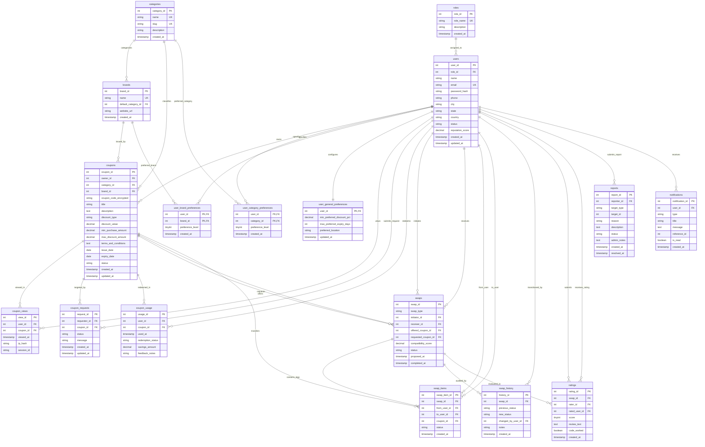

# Database Entity-Relationship Diagram (ERD)

**Project**: Smart Coupon Swap System  
**Phase**: Phase 2 — Database Design & MySQL Implementation  
**Database**: `smart_coupon_swap`  
**RDBMS**: MySQL 8.x (InnoDB Engine)  

The following Mermaid Entity-Relationship diagram accurately represents the physical schema implemented in [`database/schema.sql`](file:///C:/Users/chand/.gemini/antigravity/scratch/smart-coupon-swap-system/database/schema.sql).

---

---

## Entity Relationship Overview
- **Roles (1) to Users (M)**: System authorization tier enforcing permissions for administrators and standard users.
- **Users (1) to Coupons (M)**: Ownership relationship tracking who created and holds the voucher.
- **Categories (1) to Coupons (M)**: Retail taxonomy classification.
- **Brands (1) to Coupons (M)**: Merchant and platform affiliation.
- **Users (M) to Categories (M)**: Many-to-many relationship normalized via `user_category_preferences`.
- **Users (M) to Brands (M)**: Many-to-many relationship normalized via `user_brand_preferences`.
- **Users (1) to General Preferences (1)**: Single scalar preferences row per user storing trading thresholds.
- **Coupons (1) to Views (M)**: Behavioral impression tracking for popularity and demand modeling.
- **Coupons (1) to Requests (M)**: Wishlist and swap intent signals.
- **Coupons (1) to Usage (M)**: Post-exchange redemption verification and savings auditing.
- **Users (M) to Swaps (M)**: Master barter agreements for bilateral and multi-user exchanges.
- **Swaps (1) to Swap Items (M)**: Transfer legs deconstructing trades into atomic voucher movements (enabling 3-way circular loops: $A \to B \to C \to A$).
- **Swaps (1) to History (M)**: Immutable state transition audit trail (`PROPOSED` $\to$ `ACCEPTED` $\to$ `COMPLETED`).
- **Swaps (1) to Ratings (M)**: Bilateral peer trust evaluations with anti-self-rating constraints.
- **Users (1) to Reports (M)**: Moderation tickets for reporting users, coupons, or transactions.
- **Users (1) to Notifications (M)**: User communication alerts for transaction events.
